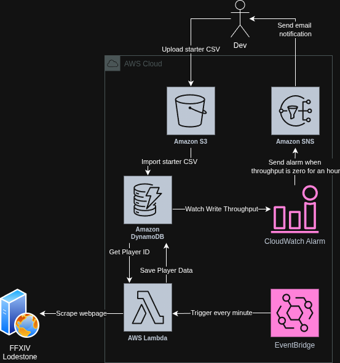

# ffxiv-char-spider
Gather data of FFXIV Characters created

Cleaned CSV is available for download at [Link](https://mega.nz/file/TJ9yEJyR#lgb-a_WuwfnesTveKuhStb0KBgbUVIbScNbHxubIlrg) (about 2.2 million rows)

## Requirements to run analytics Jupyter Notebook
* Python
* Pip
* Jupyter Notebook

## How to run jupyter notebook
* Place the downloaded `cleaned.csv` into a `./resources/` folder
* Create a Python virtual environment
* Run `pip install -r ./data/requirements.txt`
* Start Jupyter Notebook and select `./data/analytics/analytics.ipynb`
* That's it :)

> [!CAUTION]
> This is a web scraping tool!
> 
> Use it with caution! Do not disturb others and cause harm!

## Requirements to run scraper
* An AWS account
* AWS CLI
* AWS SAM
* Python3.13
* Pip
* Make

## Architecture

## Configure
* There is a hard limit on 4500 request per 15 minutes and 5 requests per second, which can only be changed through code updates.
* Update [FETCH_LIMIT](loader/loader.py) to configure the number of IDs that go into SQS every 15 minutes
* Update [MAX_RATE_SECOND](scraper/scraper.py) to configure the maximum number of requests per second
  * Be very careful with this to not send too many requests to the website 
* Update [MAX_RATE_MINUTE](scraper/scraper.py) to configure how many messages it pulls from SQS every minute
* Update [LoaderEventRule -> ScheduleExpression](template.yaml) timing to change how often the loader lambda gets triggered
* Update [ScraperEventRule -> ScheduleExpression](template.yaml) timing to change how often the scraper lambda gets triggered

## Deployment
### Database base CSV
* Generate the base CSV using the [base_csv_generator.py](util/base_csv_generator.py)
    * `python util/base_csv_generator.py -l 5000000 -u 10000000 -o output.csv`
    * All parameters have defaults, use the `python util/base_csv_generator.py --help` to learn more
* Create an S3 bucket or use an existing one
* Upload the [base_ids.csv](util/base_ids.csv) to S3

### Deployment
1. Package dependencies by running `make build-layer`
2. Build template with `sam build`
3. (Optional) Validate using `sam validate`
4. Deploy using `sam deploy --guided` and follow the instructions
   1. It takes a while because it's filling up the DynamoDB Table with the items from the CSV
   2. ~10-15 minutes
5. Wait patiently :) Do not forget to delete the CloudFormation Stack if you don't want to run this anymore. It won't auto delete.
   1. You can delete the resources with `sam delete --stack-name FFXIV`, where stack-name is what you provided during the deployment

> [!IMPORTANT]
> To enable the e-mail notification when the DynameDB write throughput drops to zero, subscribe to the SNS topic you'll get in your e-mail during deployment.

